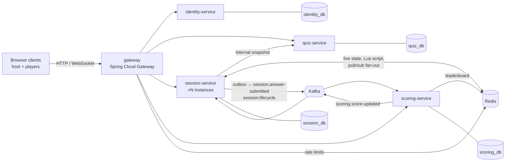

# Buzzer

[](https://github.com/nibinrj/buzzer/actions/workflows/ci.yml)

A real-time multiplayer quiz platform in the style of Kahoot. A host starts a live game, players join with a room
code, every player gets each question at the same moment, and **the first correct buzz wins the round**.

It's built as a set of microservices to work through the hard parts of distributed systems: fair ordering under
concurrency, exactly-right scores over at-least-once messaging, fan-out across instances, and finding the real
bottleneck under load.

<!-- Demo: record a 60–90 s GIF (host + 3 players, a pod deleted mid-question, Grafana, a Jaeger trace), save it as
     docs/demo.gif, and replace this comment with:  -->

**Stack:** Java 21 · Spring Boot 4.1 · Spring Cloud Gateway 2025.1 · WebSocket/STOMP · Kafka (Redpanda) · Redis ·
PostgreSQL 16 · Flyway · Testcontainers · OpenTelemetry · Prometheus · Grafana · Jaeger · Kubernetes (kind) · k6 · JMH ·
Terraform · AWS (ECS Fargate, RDS, ElastiCache) · GitHub Actions · OpenAPI · AsyncAPI

---

## Architecture



| Service | Port | Responsibility |
|---|---|---|
| `gateway` | 8080 | Single entry point (reactive). Routes, JWT check at the edge, strips spoofed `X-User-*` headers, Redis rate limiting, CORS, blocks `/internal/**` |
| `identity-service` | 8081 | Register/login, RS256 access tokens, rotating refresh tokens with reuse detection, guest tokens, JWKS endpoint |
| `quiz-service` | 8082 | Quiz authoring for hosts; publish rules; immutable published snapshot for session-service |
| `session-service` | 8083 | Rooms and joins, STOMP over WebSocket, live game state in Redis, the buzz race, transactional outbox |
| `scoring-service` | 8084 | Kafka consumer: points, Redis leaderboard, final results API, `ScoreUpdated` events |

Each service owns its database. Services share data only through REST or events, never through each other's tables.
Every service still validates the JWT itself; the gateway is a first line of defense, not the only one.

---

## The interesting parts

### 1. Fair buzz ordering across instances
Players on different session-service instances answer within milliseconds of each other, so app-server timestamps
can't decide who was first. One **Redis Lua script** decides atomically: it checks the question is open and the
deadline hasn't passed (using Redis's own clock), rejects duplicates, assigns a global sequence number with `INCR`,
and gives correct answers a `correctRank`.

- A concurrency test fires 200 answers from virtual threads released by one latch: **200 accepted, sequence exactly
  1–200 with no gaps, exactly one rank 1**. The same player answering 50 times at once is accepted exactly once.
- The script is **~8.5× faster** than sending the same commands one by one (JMH: 634 µs vs 5,361 µs), but it exists
  because it's atomic. The speed is a bonus.

### 2. Exactly-right scores over at-least-once Kafka
The answer row and an **outbox** row are written in the same transaction; a publisher sends outbox rows to Kafka
keyed by `sessionId` (per-session order). scoring-service acks only after its database commit, and a
`processed_events` table inside that same transaction makes redelivery harmless. Failures go through retry topics to
a dead-letter topic with an alert.

Points: `max(300, 1000 − 100 × (correctRank − 1))` for a correct answer, 0 otherwise. `correctRank` is fixed at write
time, so the consumer doesn't depend on arrival order.

- **Chaos-tested:** scoring-service killed mid-game, restarted, consumer lag drained, final scores compared to a SQL
  query over the raw answers: `MATCH`. The same check also passed on Kubernetes in a scripted game with session and
  scoring pods deleted mid-game.

→ [chaos procedure](docs/chaos-scoring.md)

### 3. Real-time fan-out
Players connect over STOMP/WebSocket, authenticated on `CONNECT`, with per-destination authorization (only the host
can start/advance; only the session's players can subscribe). Broadcasts go through **Redis pub/sub**, so players on
different instances see every question. A reconnecting player redraws from `GET /api/sessions/{id}/state`.

### 4. Measured, then fixed, a real bottleneck
Full games load-tested with k6 (STOMP over WebSocket, through the gateway). At 200 players the synchronous answer
path broke first: each answer took ~4.4 Postgres connections, and 32 STOMP threads queued for 10 pooled connections.
Diagnosed with Prometheus metrics and Jaeger traces, confirmed with a pool-size experiment, then fixed by caching the
data that never changes once a game starts.

| 200 players | Before | After |
|---|---:|---:|
| Answer ack p50 | 73 ms | **12 ms** |
| Answer ack p95 | 191 ms | **111 ms** |
| DB connections per answer | 4.35 | **1.19** |

The next limits are measured too (scoring's one-consumer-per-session throughput sets leaderboard latency).
Numbers come from a single laptop running everything, so they compare runs; they aren't capacity claims.

→ [docs/performance.md](docs/performance.md) · [docs/benchmarks.md](docs/benchmarks.md)

### 5. Observability
JSON logs with `traceId`/`sessionId`/`playerId`, Prometheus metrics (answer latency histograms, outbox backlog,
consumer lag, DLT count), and OpenTelemetry traces that follow one answer from the gateway through STOMP, the outbox
and Kafka into scoring. Grafana dashboards and alert rules are provisioned from the repo.

---

## Running it locally

Developed on Windows 11 with PowerShell 7; every helper is in `tasks.ps1` (`.\tasks.ps1 help`).

**Prerequisites:** JDK 21, Docker Desktop, PowerShell 7, OpenSSL. Optional: kind + kubectl (Kubernetes), k6 (load tests).

```powershell
Copy-Item .env.example .env        # then set real passwords in .env
.\tasks.ps1 keys                   # RS256 key pair into .secrets\ (gitignored)
.\tasks.ps1 up                     # Postgres, Redis, Redpanda
.\tasks.ps1 build                  # all modules + tests (Testcontainers needs Docker)
```

Run each service in its own terminal (identity first, it serves the JWKS):

```powershell
.\tasks.ps1 run -Svc identity-service
.\tasks.ps1 run -Svc quiz-service
.\tasks.ps1 run -Svc session-service
.\tasks.ps1 run -Svc scoring-service
.\tasks.ps1 run -Svc gateway
.\tasks.ps1 health                 # all five should be UP
```

Optional dashboards: `.\tasks.ps1 obs` → Grafana `:3000`, Prometheus `:9090`, Jaeger `:16686`.

### API docs
- **REST:** each service serves its OpenAPI document and Swagger UI on its own port, without a token:
  `http://localhost:8081/swagger-ui.html` (identity), `:8082` (quiz), `:8083` (session), `:8084` (scoring). Log in
  through identity, then paste the access token into **Authorize**. The gateway doesn't route the docs.
- **Real-time and events:** [docs/asyncapi.yaml](docs/asyncapi.yaml) (AsyncAPI 3.0) describes the STOMP
  destinations (host commands, answers, broadcasts, private acks) and the Kafka topics with their keys, headers,
  retry and dead-letter topics. Paste it into [AsyncAPI Studio](https://studio.asyncapi.com) to browse it.

### Play a game
`tools/test-client.html` is a minimal, framework-free demo client for exercising the real-time API; the project is
the backend. One HTML file, no build step. Serve it from localhost (the gateway refuses `file://`):

```powershell
& "$env:JAVA_HOME\bin\jwebserver.exe" -d (Resolve-Path .\tools).Path -p 5173
```

Open `http://localhost:5173/test-client.html` (base URL `http://localhost:8080`). `tools/http/flow.ps1` shows the
REST flow for creating and publishing a quiz. One tab as host, a few as players.

### On Kubernetes (kind)
```powershell
.\tasks.ps1 images                 # build the five service images
.\tasks.ps1 kind-up                # cluster + data stores + Traefik + services + Prometheus/Grafana
.\tasks.ps1 kind-obs               # Grafana 127.0.0.1:3001, Prometheus 127.0.0.1:9091
```
The app is at `http://127.0.0.1:8000`. Sized for ~4–5 GB of Docker memory. → [pod-deletion chaos run](docs/chaos-k8s.md)

### Load tests and benchmarks
```powershell
.\tools\load\run-game.ps1 -Players 50,100,200   # k6 games through the gateway
.\tasks.ps1 bench                               # JMH microbenchmarks
```

### On AWS (on demand)
The AWS environment exists only while a demo runs: ECS Fargate (Spot, arm64) behind an ALB, RDS PostgreSQL,
ElastiCache (Valkey) and Redpanda on ECS, with no NAT gateway. A long-lived bootstrap holds only the Terraform state,
the image repositories and the GitHub deploy role. Estimated at $0.30–0.50 for a two-hour demo.

```powershell
.\tasks.ps1 push        # build arm64 images for ECR (prints the push commands)
.\tasks.ps1 demo-up     # create the environment and start all services (~15 min), prints the URL
.\tasks.ps1 demo-seed   # a host and a published quiz on the running demo
.\tasks.ps1 demo-down   # destroy it, and fail if anything billable is left
```

CI builds, tests and scans every change (Trivy for image CVEs, gitleaks over the whole history). Deploys use GitHub
OIDC: no AWS key is stored anywhere.

---

## Repository layout

```
services/        gateway, identity-, quiz-, session-, scoring-service (one Maven module each)
shared-events/   event records (AnswerSubmitted, SessionStarted/Ended, ScoreUpdated) and their topic/header names, no Spring
benchmarks/      JMH benchmarks
infra/local/     Prometheus, Grafana, alert rules (shared by compose and Kubernetes)
infra/k8s/       kustomize base + kind overlay
infra/terraform/ AWS: bootstrap (state, ECR, deploy role, budget), network and ECS modules, the demo environment
.github/         CI (build, tests, image scan, secret scan) and the OIDC deploy workflow
tools/           demo client, REST flow scripts, k6 load test
docs/            AsyncAPI spec, diagrams, performance, benchmarks, chaos procedures
```

## Engineering conventions
- Hexagonal-ish layers per service: `api / application / domain / infrastructure / config`; the domain has no
  Spring, JPA or Jackson imports.
- Schema changes only through new Flyway migrations; Hibernate validates, never generates.
- Integration tests run against real Postgres, Redis and Kafka with Testcontainers.
- No secrets in the repo: `.env` and `.secrets/` are gitignored.

## Roadmap
- [x] Identity, quiz authoring, gateway
- [x] Real-time sessions, the buzz race, outbox
- [x] Kafka scoring, live leaderboard, chaos checks
- [x] Observability (metrics, traces, dashboards, alerts)
- [x] Local Kubernetes
- [x] Load tests and the first bottleneck fix
- [x] CI: build, tests, image CVE scan, secret scan on every change
- [x] AWS infrastructure in Terraform (VPC, ECS Fargate, ALB, RDS, ElastiCache, Redpanda on ECS or MSK), validated
- [x] OIDC deploy role and deploy workflow with smoke test and rollback
- [ ] First AWS demo run, with the measured cost per hour
- [ ] Load test on AWS, and the next bottleneck (scoring throughput per session)
