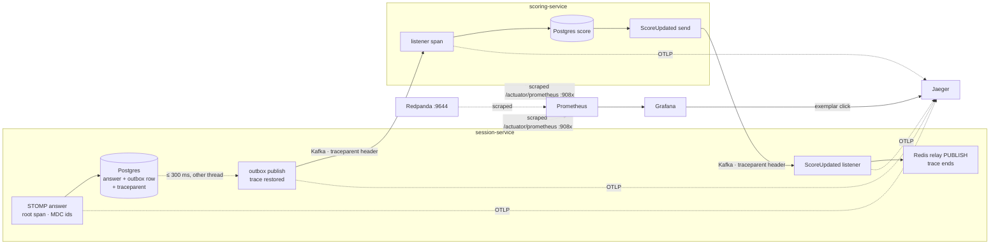

# ADR-008: Observability — JSON logs, Prometheus metrics and OpenTelemetry traces, joined by ids

- **Status:** Accepted
- **Date:** 2026-10-02
- **Deciders:** nibin
- **Related:** ADR-004 (buzz ordering), ADR-005 (async scoring), ADR-009 (local Kubernetes). ADR-006 and ADR-007 are reserved for the AWS deployment.

## Context

One answer crosses a STOMP frame, a Redis Lua script, a Postgres transaction, an outbox table, a scheduler thread, Kafka, a second service, Redis again, Kafka again, and a Redis pub/sub relay before a leaderboard moves (ADR-004, ADR-005). Before this there were plain-text console logs and `rpk group describe`. Nothing answered "is the game OK right now?", "which hop made this answer slow?" or "has scoring stopped?". The requirements:

1. **Live health of a game:** answers by outcome, ack latency against a 100 ms p99 target, open sockets, games running. Readable during a game, not only afterwards.
2. **Follow one answer across both services**, through the asynchronous hops (outbox thread, Kafka, retries) where in-memory context is lost.
3. **See failures players don't see.** With asynchronous scoring (ADR-005), a dead scoring-service, a full DLT or a stuck outbox all look fine in the browser: answers are still acked.
4. **Correct across instances.** Several session-service tasks run at once (ADR-003). A percentile and a backlog must mean the same with one instance or ten.
5. **Bounded cost and no leaks.** No unbounded metric labels (session ids); no tokens, passwords or message bodies in any signal.
6. **Same instrumentation everywhere:** local, the kind cluster, AWS (CloudWatch). Application code mustn't depend on a vendor.
7. **Standard tools,** widely used in industry, and simple enough to explain line by line.

## Decision

### Logs
1. **Spring Boot's built-in structured logging, Elastic Common Schema**, one JSON object per line on stdout (`logging.structured.format.console: ecs`). No logback XML, no encoder library. A `human` profile switches terminals back to text; `.\tasks.ps1 run` uses it.
2. **MDC ids on every line:** `sessionId`, `userId`, `playerId` from each entry point (HTTP interceptor, STOMP `ExecutorChannelInterceptor`, Kafka listeners). `traceId`/`spanId` come from tracing. Each place removes only its own keys, never `MDC.clear()`.
3. **Never log a token:** a test sends four kinds of token through the gateway at DEBUG and asserts none appears. It found Spring Cloud Gateway's `ObservedRequestHttpHeadersFilter` logging `Authorization` headers at DEBUG; that logger is pinned to INFO.

### Metrics
4. **Micrometer to Prometheus, pulled** from `/actuator/prometheus` on a **separate management port** (9080–9084) that no gateway route, ALB or Ingress exposes.
5. **Histograms with fixed buckets** (`management.metrics.distribution.slo`), never percentiles computed in the JVM: bucket counts add up across instances; percentiles don't.
6. **One common tag, `application`.** Prometheus adds `instance` and `job` itself.
7. **No ids as labels.** Bounded tags only: outcome (8 values), result, type, topic, route template. Meters are registered at 0 up front, so `rate()` sees their first event.
8. **Domain meters**: end-to-end and controller ack latency by outcome; sockets; games; outbox backlog and oldest age; relay failures; leaderboard pushes; events applied vs duplicate; scoring delay; ScoreUpdated published vs outside the top 10; leaderboard rebuilds; DLT records. Gauges that read Postgres are the same on every instance: dashboards take `max()`, never `sum()`.

### Traces
9. **Micrometer Tracing with the OpenTelemetry bridge, exported over OTLP/HTTP** (`spring-boot-starter-opentelemetry`; the OTLP *metrics* push it brings is switched off). W3C `traceparent` everywhere. Sampling 1.0 locally, parent-based, so a trace is complete or absent.
10. **Automatic:** HTTP (gateway → services, session → quiz) and Kafka (template and listener observation; retry and DLT forwards keep the header).
11. **STOMP gets its own observation**, `buzzer.stomp.command`, as the trace's **root**: spring-messaging 7.0 has none, and browsers send no trace.
12. **The outbox carries the trace as data.** Each row stores the current `traceparent`, written by the propagator, in V5's new column. The publisher restores it with a `ReceiverContext` observation, so KafkaTemplate's own span joins the answer's trace. The trace deliberately ends at the Redis relay `PUBLISH`.

### Joining the three
13. **Logs to traces:** `traceId` is a field of every log line written inside a span. **Metrics to traces:** histogram buckets carry exemplars (`trace_id`); Grafana opens them in Jaeger.

### Where it all goes locally
14. **docker compose, profile `obs`:** Prometheus v3.15.0 (exemplar storage on), Grafana 13.2.3 (provisioned datasources and dashboards; plugin pre-install off; no data volume), Jaeger 2.20.0 (OTLP in, in-memory storage). All pinned.
15. **Consumer lag measured by the broker:** recording rule `buzzer:consumer_group_lag` = Redpanda's partition end minus each group's committed offset. It keeps rising while the consumer is dead.
16. **Five alert rules** (DLT, scoring lag, ack p99, outbox stuck, service down) and **two dashboards** ("Buzzer Game", "Buzzer Service RED"), all as files in Git.

### One answer, three signals

## Alternatives considered

| Option | Why not |
|---|---|
| **Tempo** instead of Jaeger | The better Grafana fit (one UI, native exemplar links). Jaeger was chosen for its standalone UI and because it's the name job ads and ATS filters ask for. Exemplar links work with Jaeger as a Grafana datasource too. |
| **OpenTelemetry Java agent** (bytecode auto-instrumentation) | No code at all, but the instrumentation is invisible and hard to explain line by line (requirement 7), and it still wouldn't store a trace in our outbox row. Micrometer Tracing is what Spring instruments natively, and our two custom pieces (STOMP, outbox) use the same Observation API. |
| **OpenTelemetry Collector** between services and backend | Useful for fan-out, tail sampling and auth, but locally it's one more hop and config file with nothing to do. Services send OTLP straight to Jaeger. Revisit on Kubernetes. |
| **Percentiles computed in the JVM** (`percentiles: 0.99`) | Three instances report three p99s that can't be combined into one. Buckets can (requirement 4). |
| **Micrometer's automatic histogram** (`percentiles-histogram: true`) | About 70 buckets per timer per tag combination. Ten explainable SLO buckets are enough. |
| **Push metrics over OTLP** (the starter's default) | Prometheus already pulls, and an unreachable push endpoint logs a failure every minute. Pull also makes a dead service visible as `up == 0`. |
| **Same port + "deny `/actuator` at the gateway"** | A rule can be reordered or forgotten; the gateway's *own* actuator was reachable by any logged-in guest. An unexposed port has no rule to get wrong. |
| **Logstash format / logstash-logback-encoder** | One library's habit rather than a published schema. Boot writes ECS itself: one property, no XML. |
| **Tracing baggage** to carry `sessionId` | Propagates by itself, but adds headers to every message and hides where ids come from. Explicit MDC at four entry points is visible and explainable. |
| **Consumer-reported lag only** (`kafka_consumer_…_records_lag`) | It vanishes when the consumer dies, the very outage it should report. Broker-side lag doesn't. |
| **Span links** for the outbox publish | OpenTelemetry's model for batch publishing. We publish row by row, and a parent per row gives the one-click end-to-end trace. |
| **Formatting `traceparent` by hand** | The propagator writes exactly what an HTTP or Kafka header would get, sampled flag included. |
| **Jaeger 2.21.0** (the newest) | It removed the HTTP API Grafana's Jaeger datasource calls (#9260). Pinned to 2.20.0 until Grafana speaks the v3 API. |
| **Loki** for logs locally | Not needed yet: JSON on the console, `traceId` to cross over. CloudWatch Logs is the AWS answer. |

## Consequences

**Positive**
- **An answer can be followed end to end:** from a dashboard spike (exemplar), to its trace across both services, to its log lines (`traceId`).
- **Asynchronous failures are visible before players notice:** a dead scoring-service fires `BuzzerServiceDown` and `BuzzerScoringLagHigh` (broker-side), the DLT and a stuck outbox each have an alert, and the outbox's delay is visible as a gap in every trace.
- **Correct across instances by construction:** summed buckets, `max()` for database-wide gauges, `sum()` for per-instance ones.
- **Application code depends only on SLF4J, Micrometer and Micrometer Tracing,** none of them vendors. The backend (Jaeger, CloudWatch, anything that speaks OTLP or scrapes Prometheus) changes by configuration.
- **Writing the instrumentation found real defects,** each now fixed and tested:
  - STOMP channels ran on the outbox's single thread, so a Kafka outage would have frozen the game (fixed with `defaultCandidate = false`).
  - The gateway logged tokens at DEBUG.
  - A rebuild counter that would have counted every new game.
  - A DLT counter created only on the first record, which the alert would have missed (fixed: registered at startup).

**Negative, accepted on purpose**
- **More moving parts locally:** three more containers, and two required `.env` entries without which compose refuses to run.
- **The management port has a cost:** health checks moved to 9080–9084, MockMvc-only test contexts became `RANDOM_PORT`, and the ALB health check will target another port.
- **Scrape-time database queries:** three small queries per scrape per session-service instance. The active-sessions count needed a partial index (V4).
- **The trace ends at the Redis relay:** deliveries to players on other instances aren't in it.
- **Known measurement limits:**
  - **End-to-end ack latency carries no exemplars:** it's stopped outside the trace.
  - **Scoring delay subtracts two clocks** (Redis, JVM).
  - **Per-partition consumer lag appears up to 60 s after a consumer starts** (Micrometer's Kafka binder refresh).
  - **Broker lag can't see a partition a group has never committed on.**
- **Grafana keeps nothing between restarts:** dashboards are edited as JSON, not saved in the UI.
- **Jaeger is pinned behind the newest release,** and alerts notify nobody locally (no Alertmanager).

## Verification

| Claim | Evidence |
|---|---|
| Every line is ECS JSON with MDC ids as fields; the `human` profile prints text | `*ApplicationTests.logsOneEcsJsonObjectPerLineWithMdcEntriesAsFields` (5 services); the gateway jar started under both profiles |
| No token reaches the logs, even at DEBUG | `LogSafetyTest` (gateway; red before pinning the logger); `SessionWebSocketTest…TheTokenIsNeverLogged` |
| A STOMP answer's log line carries session, user, player, trace and span ids | `SessionWebSocketTest.anAnswersLogLineCarriesSessionUserAndPlayerAndTheTokenIsNeverLogged` |
| Metrics only on the management port; fixed buckets; `application` tag; no ids in labels | `MetricsEndpointTest` (5 services) |
| Each domain meter moves | `SessionWebSocketTest` (timers, sockets, games, outbox gauges), `LeaderboardPushTest`, `RedisRelayTest`, `ScoringEventListenerTest`, `LeaderboardFlowTest` |
| The DLT counters exist at 0 before any record, so the alert sees the first one | `ScoringEventListenerTest.bothDltCountersExistBeforeAnyRecordIsDeadLettered` (red with the registration removed) |
| STOMP no longer shares the outbox's thread | `SessionWebSocketTest.anAnswerIsAckedWhileTheOutboxThreadIsBusy` (red before the fix), `StompExecutorTest` |
| One answer is one trace: STOMP root, outbox row, outbox publish, Kafka record | `SessionWebSocketTest.anAnswersTraceRunsFromTheStompCommandThroughTheOutboxIntoTheKafkaRecord` |
| scoring-service continues the trace and passes it on in ScoreUpdated | scoring `TracingTest` |
| The gateway continues or starts a trace and forwards it | `TracePropagationTest` |
| Rules are valid and loaded | `promtool check rules` (1 + 5 rules); Prometheus `health: ok` for all six, 2026-10-02 |
| Every dashboard query is valid against real metrics; both dashboards load | 27/27 queries returned success against four running services; Grafana API shows both in "Buzzer", 2026-10-02 |
| Prometheus scrapes services and Redpanda; Jaeger receives traces; exemplars flow | identity-service live, 2026-10-02: target up, trace in Jaeger, `trace_id` exemplar on its bucket |
| Broker-side lag rises while scoring-service is down, and the alert fires | Manual run: kill scoring-service mid-game, watch "Scoring lag at the broker" and `BuzzerScoringLagHigh` |

## Revisit when

- **On Kubernetes (kind):** Prometheus finds pods by Kubernetes service discovery instead of `host.docker.internal`; consider an OpenTelemetry Collector as the single OTLP endpoint; the management port becomes a container port that no Service exposes publicly.
- **On AWS:** CloudWatch for metrics and logs. Decide between CloudWatch's Prometheus scraping and the ADOT collector. Choose a sampling ratio below 1.0 (the root decides; downstream follows).
- **Grafana's Jaeger datasource supports the v3 API:** upgrade Jaeger past 2.20.0.
- **Logs need searching across services:** add Loki locally, or rely on CloudWatch Logs Insights in AWS.
- **Players on other instances need to be in the trace:** carry `traceparent` inside `RelayMessage`.
- **A metric's series count grows with traffic** (a new tag, a raw path): treat it as a bug. The `MetricsEndpointTest` id check is the model for a test.
