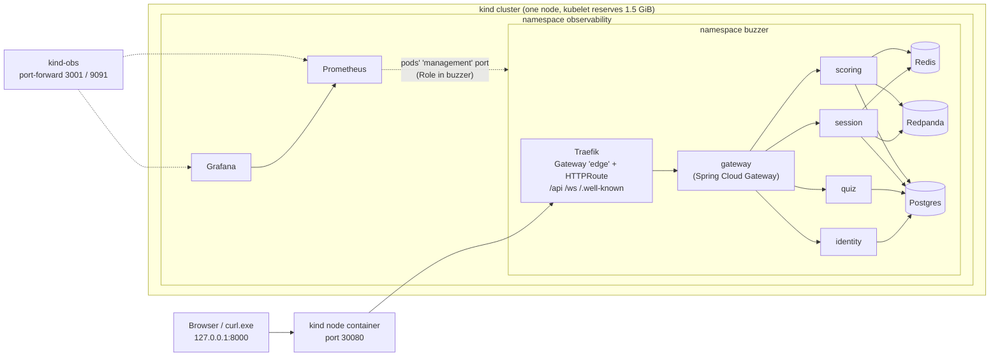

# ADR-009: Local Kubernetes on kind, ECS Fargate in AWS, sized to the dev machine

- **Status:** Accepted
- **Date:** 2026-10-03
- **Deciders:** nibin
- **Related:** ADR-003 (realtime transport), ADR-005 (async scoring), ADR-008 (observability), [docs/chaos-k8s.md](../chaos-k8s.md). ADR-006 and ADR-007 are reserved for the AWS deployment.

## Context

Until now the system ran as five JVMs on the host plus docker compose. The AWS design is ECS Fargate, now an **on-demand demo environment** that exists only while someone is looking at it. Nothing yet showed that the services behave correctly under an orchestrator: when a pod disappears, when traffic arrives through a proxy, or when a replica count changes. Kubernetes is also what most job descriptions ask for. The requirements:

1. **Demonstrable Kubernetes skills:** Deployments, StatefulSets, probes, rollouts, Services, an edge, config and secrets, scraping, all explainable line by line.
2. **Zero standing cloud cost.** Kubernetes practice mustn't add a monthly bill, and the AWS demo stays at cents per demo hour.
3. **One set of images** for the local cluster and ECS.
4. **Fit the dev machine:** 15.7 GB of RAM, a Docker VM at its default of 7.6 GB, and Windows needing the rest.
5. **Reproducible from the repo, with no secrets in it:** one command up, one down, and the same result on a fresh clone with `.env` and `.secrets\`.
6. **Prove ADR-003's and ADR-005's resilience claims on an orchestrator:** players survive losing their pod, and the Kafka consumer group hands partitions over without losing or double-counting an answer.
7. **The dashboards and alerts work on the cluster too** (ADR-008, "Revisit when: On Kubernetes").

## Decision

### Where Kubernetes runs
1. **kind locally, ECS Fargate in AWS. No EKS.** The Kubernetes skill is built and shown on kind for free. AWS keeps the cheaper, faster-to-create ECS.
2. **One kind node, config as code** (`infra/k8s/kind-config.yaml`). The node image is pinned by digest (`kindest/node:v1.37.0@sha256:a1ed56cf…`), so the cluster is the same whichever kind binary creates it.

### The way in
3. **Gateway API, implemented by Traefik v3.7.13** (GatewayClass `traefik`, Gateway `edge`, HTTPRoute `buzzer-api`). The HTTPRoute forwards **only `/api`, `/ws` and `/.well-known`** to our Spring Cloud Gateway, which keeps doing JWT checks, rate limiting and routing exactly as before (ADR-002). Gateway API CRDs v1.6.1 (the version Traefik is built against) are installed by `kind-up` only when missing.
4. **One host port: `127.0.0.1:8000`** → node port 30080 → Traefik. It's IPv4 and loopback only, so the LAN can't reach it. Use `127.0.0.1`, not `localhost`: Windows tries `::1` first, which costs ~2 s per PowerShell request.
5. **The gateway trusts exactly one proxy hop** (`GATEWAY_CLIENTIP_TRUSTEDPROXIES=1`). Traefik's `X-Forwarded-For` entry identifies the client, so rate limits stay per client and can't be dodged by sending the header.

### Manifests, images, secrets
6. **Plain YAML with Kustomize** (`base/` + `overlays/kind`). No Helm.
   - ConfigMap generators sit **next to the files they read**: the init SQL, the alert rules, the dashboards. Compose and the cluster share one copy of each, which is how Kustomize's load restrictor is respected.
   - Every address a service needs comes from `services-config`, by the env var names its `application.yml` already had. **No service code changed for Kubernetes.**
7. **One Dockerfile for all five services**:
   - the jar is built on the host, then split into Boot 4's `tools` jar-mode layers
   - Temurin 21 JRE pinned by its multi-arch digest
   - runs as uid **10001**, JVM flags in an exec-form ENTRYPOINT
   - `kind-up` copies images from Docker into the node (`kind load`), so the node never pulls them itself
   - the overlay deploys the moving tag `:kind`; the commit is kept in the image's `revision` label
8. **Secrets never touch the repo or the disk:**
   - `tasks.ps1` builds **one Secret per concern** (`postgres-credentials`, `redis-credentials`, `identity-jwt`, `grafana-admin`) from `.env` and `.secrets\`.
   - It pipes them to `kubectl apply --server-side` over stdin. Client-side apply would copy every value into an annotation.
   - Pods take single keys, never a whole Secret. The JWT keys are mounted as files (mode 0440).

### Workloads
9. **Every service Deployment:**
   - probes `/readyz` and `/livez` **on the service port**, with a startup probe so slow starts aren't killed
   - `preStop` sleeps 5 s (native sleep action), `terminationGracePeriodSeconds: 45`
   - non-root, `readOnlyRootFilesystem`, all capabilities dropped, seccomp `RuntimeDefault`
   - no ServiceAccount token, `enableServiceLinks: false` (a Service named `redis` would otherwise break `${REDIS_PORT}`)
10. **The data stores are dev-only StatefulSets:** Postgres 16, Redis 7 and Redpanda, the same images as compose, each with a PVC. AWS uses the managed equivalents (RDS, ElastiCache, MSK).

### Observability on the cluster
11. **Prometheus + Grafana, from the same rule and dashboard files as compose.** Prometheus discovers pods through the Kubernetes API and keeps each service's port named `management`. Its permission is a **Role in `buzzer`** (list pods, nothing else). `.\tasks.ps1 kind-obs` port-forwards Grafana (3001) and Prometheus (9091); neither is routed by Traefik. **No Jaeger and no Loki** on the cluster.

### Memory: the budget that shaped everything
12. **Honest accounting.** The kubelet reserves `systemReserved: 1536Mi` with eviction at `256Mi` free, and **every pod's memory request equals its limit**. The scheduler's sum is the real worst case: a pod that doesn't fit stays `Pending` instead of the node being OOM-killed.
13. **One copy of every service** (a deliberate choice: observability over replicas). Each JVM gets 640Mi with the heap at 60% (Serial GC, as the JVM picks at that size). **5.1 GiB reserved, 3.87 GiB actually used**, on the default 7.6 GB Docker VM. The base keeps production-like counts (gateway 2, session 3, scoring 2) for a bigger machine.
14. **Resilience is shown by borrowing slots** ([chaos-k8s.md](../chaos-k8s.md)): quiz-service → 0 lets session-service run 2 mid-game (the session holds its quiz snapshot, 3.2). Then session → 1 lets scoring-service run 2 for the consumer-group hand-over. `kubectl apply -k` restores one of each. **No HPA.**

## Alternatives considered

| Option | Why not |
|---|---|
| **EKS** for AWS | The control plane alone is $0.10/h (~$73 a month if left up), before nodes. Creating a cluster typically takes 10+ minutes, against an on-demand demo environment created and destroyed per demo. It also brings the AWS Load Balancer Controller, IAM roles for service accounts, and node groups or Fargate profiles: several more things to own, all duplicating what ECS gives. The Kubernetes skill is already shown on kind. |
| **No Kubernetes at all** (ECS only) | Cheapest and simplest, but the CV would show no Kubernetes, and nothing would prove the services behave under an orchestrator (requirement 6). |
| **minikube / k3d / Docker Desktop's Kubernetes** | minikube adds its own driver and addon layer; k3d runs k3s, a distribution with its own defaults; Docker Desktop's is a GUI toggle, not a file in the repo. kind is upstream Kubernetes, config as code, and what Kubernetes' own CI uses. |
| **ingress-nginx** | Retired on 24 March 2026: no releases, no security fixes. |
| **cloud-provider-kind** (LoadBalancer + its own Gateway API) | On Windows it needs an administrator shell running for as long as the cluster is used, and it publishes each load balancer on an ephemeral port. |
| **Helm charts** (Bitnami, kube-prometheus-stack) | You'd explain `values.yaml` instead of what runs. kube-prometheus-stack alone is ~1 GB (operator, node-exporter, kube-state-metrics, Alertmanager), and Bitnami's free images changed in 2025. |
| **Operators** (CloudNativePG, Strimzi, the Redpanda Operator) | High availability and backups that a disposable dev cluster doesn't need, at a RAM cost it can't afford. |
| **Kustomize `secretGenerator`** (the first plan) | Needs a second copy of the secrets inside `infra/k8s/` (load restrictor), an avoidable leak risk. `tasks.ps1` over stdin needs no copy. |
| **ServiceMonitor / `prometheus.io/*` annotations** for scraping | ServiceMonitor needs the Prometheus Operator. Annotations duplicate port numbers that the Deployments already name. Selecting by port name needs nothing extra. |
| **Production-like replica counts** (gateway 2, session 3, scoring 2) | They don't fit beside Prometheus and Grafana. Observability won. |
| **Smaller JVMs** (448–576Mi, heap 35–50%) | Fits more replicas, but needs the Dockerfile's heap flag moved into `JAVA_TOOL_OPTIONS`, leaves ~160–290 MiB of heap for the load tests, and session-service already uses ~470–500 MiB. |
| **A bigger Docker VM** (9–10 GB) | Would restore replicas and the full observability stack. Docker stays at its default so Windows keeps its memory; it's a one-line `.wslconfig` change when that changes. |
| **The full observability stack in the cluster** (Jaeger + Loki + Alloy) | +1–1.5 GB. The compose stack has traces; `kubectl logs` covers the cluster. |
| **HPA** | Needs metrics-server and ~0.6 GiB per extra session pod. CPU is also a weak signal for WebSocket load. The production answer is in chaos-k8s §12. |
| **Several kind nodes** | +~0.6 GB per node, for scheduling demos the requirements don't ask for. |

## Consequences

**Positive**
- **The whole system runs on Kubernetes with one command** (`.\tasks.ps1 kind-up`, 57 s on a warm cluster) and goes away with one (`kind-down`). No secrets are in the repo, and no service code changed.
- **The resilience claims are shown on an orchestrator,** not just argued:
  - a deleted session pod's players reconnect while the other pod's don't notice
  - a deleted scoring pod's partition is taken over in ~2 s after its shutdown
  - scores `MATCH`
- **The same images will run on ECS.** The same dashboards and alerts work on compose and on the cluster.
- **The memory budget is enforced, not hoped for:** an overcommit now shows up as a `Pending` pod with a reason.
- **Building it found real problems,** each fixed:
  - **Probes would never have passed:** health groups answered 401 (the security rules permitted only the exact `/actuator/health`). Fixed, with a test in each service.
  - **The whole node was OOM-killed** because kind reports the entire VM as allocatable → kubelet reservation + request = limit.
  - **Grafana 13 was killed mid-start in a loop** at 192Mi → startup probe + 384Mi.
  - **Probe traffic was 95% of the gateway's dashboard request rate** → the dashboard excludes `/livez`, `/readyz`.
  - **Behind a proxy, every user would share one rate-limit bucket** → one trusted hop.
  - **`localhost` cost ~2 s per request** from PowerShell → `127.0.0.1`.
  - **The node's own image pulls failed** (truncated download, DNS) → images are loaded from the host.
  - **A stale compiled class** in one service's jar kept the old security rules → rebuilt from clean.

**Negative, accepted on purpose**
- **One copy of every service:** a restart or deletion is a short outage for that service. Rollouts stop the old pod first (`maxSurge: 0`). The Redis relay across session pods is only exercised in chaos runs.
- **No traces and no log search on the cluster:** traces exist only in the compose setup, and logs are `kubectl logs`. Dashboards keep 2 days on scratch storage and lose history when Prometheus' pod restarts. Alerts notify nobody.
- **Not production-shaped:**
  - one node, dev-only data with no HA or backups
  - Serial GC and small heaps, so numbers from kind don't predict ECS
  - no HPA or PodDisruptionBudget
  - plain HTTP
  - Secrets base64 in etcd without encryption at rest
  - a moving image tag
- **Chaos runs juggle slots** (quiz → 0, session → 1), which a real cluster wouldn't need.
- **Tooling:** the local kind binary is an alpha build (harmless, because the node image is pinned). Dashboards are reached by port-forward, not a URL.

## Verification

| Claim | Evidence |
|---|---|
| One image per service: non-root, layered, heap from the container limit, graceful on SIGTERM | Image smoke test: uid 10001, `Max. Heap 297.75M` at `--memory 512m`, a code change = one 63 kB layer, quiz-service image `UP`, `Graceful shutdown complete` |
| The data layer works in the cluster and keeps data across pod deletion | Data-layer checks: four databases from the init SQL; `quiz_app` refused on `session_db`; Redis `NOAUTH` without the password; a Kafka round trip via the advertised name; a row survives deleting `postgres-0` |
| Secrets leave no copy in annotations | `kubectl get secret … -o jsonpath='{.metadata.annotations}'` is empty |
| Probes pass without a token, on both ports | `HealthProbeTest` ×5 (red with the old SecurityConfig: 4/5 failed with 401) |
| Only the API is reachable from outside; a full game works through the edge | Scripted game through the edge: `/livez`, `/readyz`, `/actuator/*`, `/internal/*` → 404 from Traefik; 6/6 question, ack and reveal across 2 session pods (4 + 3 sockets); scores via Kafka |
| Spoofing `X-Forwarded-For` doesn't escape the rate limiter | 40 requests in < 1 s: `200 ×20, 429 ×20`, with and without a different spoofed header on each request |
| Prometheus finds every service; rules load; dashboards provision and show a game | Observability checks: 5 `buzzer` targets + Redpanda up; both rule groups `ok`; Grafana "finished to provision dashboards"; after a game: answers by outcome, p99 97 ms, score updates, pushes, lag 0 |
| The memory accounting holds | Node allocatable 6,140,124Ki after the reservation. With one pod too many at 7.6 GB, Prometheus stayed `Pending (Insufficient memory)` and the node kept running. Final: 5,538Mi requested = 92%; 3.87 GiB in use. |
| Slot borrowing, the consumer-group hand-over, and restore work as written | chaos-k8s dry run (2026-10-03): second session pod ready in 15 s; survivor owns the partition at 10 s, replacement rejoins at 14 s; `apply -k` back to 1-of-each; SQL check through `kubectl exec` → `MATCH` |
| Players survive losing their pod; the other pod's players don't notice; scores `MATCH` | **A manual chaos-k8s run with the test client** (§13 of the runbook), with the `kubectl get pods -w` log and dashboard screenshots |

## Revisit when

- **The machine has more memory** (Docker VM ≥ 9–10 GB): restore the base replica counts, add Jaeger and Loki + Alloy, and try an HPA with metrics-server. Even then, prefer scaling session-service on WebSocket connections over CPU.
- **On AWS (ECS):** the same images, built for arm64 (if Fargate Spot supports it) with `docker buildx --push`. The ALB health check targets `/readyz` on the service port. ECS has no `preStop`: use `stopTimeout` and the deregistration delay for the same drain.
- **Load tests** run on the host, where the full dashboards and traces work. If they ever run on kind, raise the JVM limits first, or Serial GC on small heaps will be the bottleneck being measured.
- **Kubernetes on a real cloud becomes a requirement** (a job asks for EKS): a time-boxed EKS demo built from these manifests, with the overlay as the starting point.
- **The edge is exposed beyond this PC:** TLS on the Gateway listener, and encryption at rest for Secrets.
- **kind, Traefik or Gateway API release a version we need:** swap the alpha kind for a stable release; upgrade Traefik and the CRDs together (Traefik pins the Gateway API version it implements).
