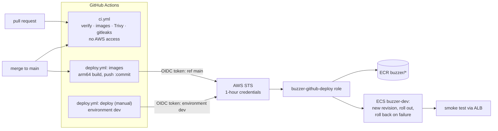

# ADR-010: Delivery pipeline: CI on every change, keyless deploys through GitHub OIDC

- **Status:** Proposed (CI and the deploy role exist; the deploy workflow is designed below, not yet in the repo)
- **Date:** 2026-10-04
- **Deciders:** nibin
- **Related:** ADR-006 (network, ECR in the bootstrap), ADR-007 (the demo environment). Code: `.github/workflows/ci.yml`,
  `infra/terraform/bootstrap/github-oidc.tf`.

## Context

The repository is public. Two things must hold at the same time:

1. **Every change is built, tested and scanned** (unit + Testcontainers tests, image CVEs, leaked secrets in the whole
   history), including pull requests from forks, which must never get AWS access.
2. **Merges reach AWS without anyone holding an AWS key.** A long-lived access key in GitHub secrets is the classic
   credential leak: valid from anywhere, for as long as nobody notices.

And one constraint from ADR-007: the demo environment exists only during a demo. A deploy must work when it exists
and do nothing harmful when it doesn't.

## Decision

### CI (`ci.yml`, exists)
1. On every pull request and push to main: `./mvnw verify` (all modules, Testcontainers on the Linux runner), the five
   images built, **Trivy fails the run on fixable CRITICAL CVEs**, **gitleaks scans the full history**.
2. `permissions: contents: read`, no secrets, no AWS: safe for forks. Every action pinned by commit SHA and every
   container image by digest.

### The deploy role (`bootstrap/github-oidc.tf`, exists)
3. **GitHub is an OIDC identity provider in the AWS account.** A workflow job trades its GitHub-signed token for
   one-hour credentials of `buzzer-github-deploy`. Nothing long-lived exists to leak.
4. **The trust policy names exactly two token subjects:** `repo:nibinrj/buzzer:ref:refs/heads/main` (a push to main)
   and `repo:nibinrj/buzzer:environment:dev` (a job in the `dev` environment). Pull requests, other branches and
   forks get no credentials. The audience must be `sts.amazonaws.com`.
5. **Least privilege, each permission explained in the code:** ECR login; push to the five `buzzer/*` repositories
   only; read and register task definitions (IAM can't scope those to a resource); describe and update services in
   the `buzzer-dev` cluster only; `iam:PassRole` only for the demo's own `buzzer-dev-*` roles and only to ECS tasks,
   so the role can't hand itself more power; describe load balancers for the smoke test.
6. In the **bootstrap**, not the demo stack: images are pushed on every merge, also between demos.

### The deploy workflow (`deploy.yml`, designed, not yet added)
7. **On every merge to main: push images.** An arm64 runner builds the five images natively (the tasks run on
   Graviton) and pushes them tagged with the short commit id, skipping any tag that already exists (ECR tags are
   immutable). The next `demo-up -Tag <commit>` runs them.
8. **Manual deploy of one service** (`workflow_dispatch`, input `service`, main only, `environment: dev`):
   - no `buzzer-dev` cluster → a notice and a green run: nothing to deploy to;
   - copy the running task definition, change only the image tag, register the next revision;
   - `update-service`, wait until stable;
   - **smoke test:** the primary deployment must be the *new* revision with rollout COMPLETED (ECS's circuit
     breaker may already have rolled back, and that is "stable" too), then `/readyz` through the ALB and
     identity-service's JWKS through the gateway;
   - **any failure after the rollout started → update-service back to the previous revision**, wait, fail the run.
9. The role ARN is a repository **variable** (`AWS_DEPLOY_ROLE_ARN`), not a secret: an ARN grants nothing without a
   token the trust policy accepts.

## Alternatives considered

| Option | Why not |
|---|---|
| **Access keys in GitHub secrets** | Long-lived, valid from anywhere, must be rotated by hand, and the classic leak. OIDC costs nothing extra. |
| **Trust `repo:nibinrj/buzzer:*`** | Any branch or pull request from the repository could deploy. Subjects are listed exactly. |
| **Deploy every merge automatically** | Most merges happen with no demo running; a deploy job that usually has nothing to do would usually be noise. Images are pushed always, rollouts on request. |
| **Terraform apply from CI** | CI would need rights to create and destroy everything (IAM, VPC, RDS). Changes to infrastructure stay a reviewed, local `terraform apply`. |
| **`amazon-ecs-deploy-task-definition` and similar actions** | Every third-party action is code with the deploy role's credentials. A few `aws` CLI calls do the same and are readable in the workflow. |
| **x86 runner with QEMU for arm64 images** | Works (`tasks.ps1 push` does it locally), but a native arm64 runner is faster and free for public repositories. |
| **Blue/green with CodeDeploy** | A second target group, a CodeDeploy application and its role, for a demo with one gateway task. The circuit breaker plus an explicit rollback covers the demo. |

## Consequences

**Positive**
- No AWS credential exists outside AWS; what GitHub gets expires within the hour and only for main or `dev`.
- A broken image never stays deployed: ECS's circuit breaker or the workflow's own check puts the previous revision back.
- Pull requests, including from forks, run the full CI with zero cloud access.

**Negative, accepted**
- **The smoke test can't reach quiz, session or scoring directly** (only the gateway is public, and the gateway
  answers 401 before calling them without a token). For those, "deployed" means ECS ran the new revision to
  completion. A real check would log in a test user through the gateway.
- **A Terraform apply after a CI deploy resets the image** to whatever `image_tag` the apply names. Terraform stays
  the source of truth; pass the deployed commit as `-Tag`.
- `RegisterTaskDefinition` and `DescribeTaskDefinition` can't be scoped to this project in IAM. `PassRole` is what
  bounds the damage: a new revision can only run with the demo's own roles.

## Verification

| Claim | Evidence |
|---|---|
| CI builds, tests and scans every change | Green runs on GitHub (build, tests, images, Trivy, gitleaks), 2026-10-03 |
| The deploy role is valid Terraform | `terraform validate` in `bootstrap`: "Success! The configuration is valid." (2026-10-04) |
| Only main and `dev` can assume the role | **Owed:** after the bootstrap apply, a workflow on another branch fails at "AWS credentials" with "Not authorized to perform sts:AssumeRoleWithWebIdentity" |
| Merges push images | **Owed:** `deploy.yml` added; after a merge, `aws ecr describe-images` shows the commit's tag in all five repositories |
| Deploy and rollback | **Owed:** during a demo, dispatch a deploy and see the new tag running; then deploy a commit whose gateway fails `/readyz` and see the run roll back |

## Revisit when

- **More than one environment:** one role per environment, each trusting only its own GitHub environment, with
  required reviewers on production.
- **Infrastructure changes become frequent:** `terraform plan` in CI on pull requests (read-only role), apply still
  by hand or behind an approval.
- **Real users:** an authenticated smoke test (a test account through the gateway) and alarms that roll back
  automatically after a deploy.
