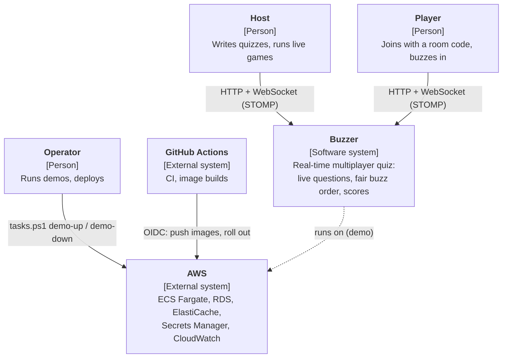
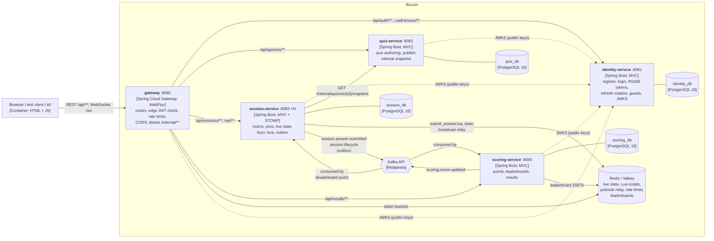
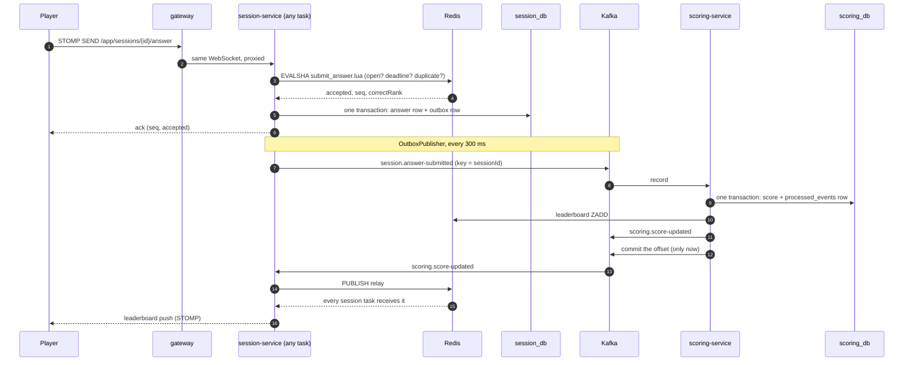
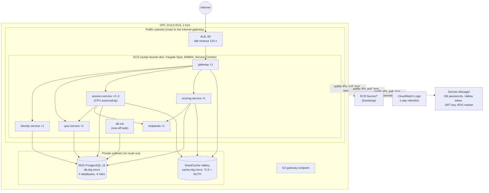
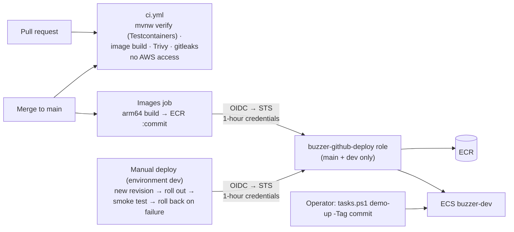

# Diagrams

C4-style views of Buzzer, drawn from the code and Terraform as they are (Mermaid, rendered by GitHub).

| Diagram | Shows |
|---|---|
| [1. System context](#1-system-context) | Who uses Buzzer and what it depends on |
| [2. Containers](#2-containers) | The five services, their stores, and every call or event between them |
| [3. One answer, end to end](#3-one-answer-end-to-end) | The buzz race and asynchronous scoring as a sequence |
| [4. AWS deployment](#4-aws-deployment) | The demo environment: network, ECS, data stores |
| [5. Delivery](#5-delivery) | CI, images and deploys |

## 1. System context

## 2. Containers

Kafka carries exactly three topics. Everything else between services is a REST call.

## 3. One answer, end to end

## 4. AWS deployment

The demo environment in ap-south-1, created by `.\tasks.ps1 demo-up` and destroyed by `demo-down`.

Security groups allow each arrow above and nothing else: the ALB accepts port 80 from anywhere and reaches only the
gateway; each service accepts only its callers on its own port; RDS and Valkey accept only the services that use them.

## 5. Delivery

`.github/workflows/deploy.yml` runs both jobs. Until its `AWS_DEPLOY_ROLE_ARN` variable is set, `.\tasks.ps1 push`
builds the images and the operator pushes them.
